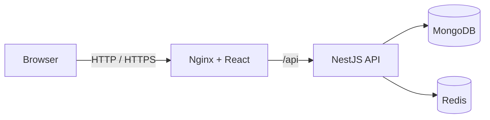

# Architecture

## Overview

The platform is a modular monolith with a React single-page application and a NestJS API. MongoDB stores durable business data, while Redis provides revocable server-side sessions and short-lived resource locks.

The browser has no direct access to MongoDB or Redis. In Docker Compose, Nginx is the only service published to the host, and it is bound to the loopback interface by default.

## Application boundaries

- **Authentication and users** manage credentials, roles and revocable sessions.
- **GPU resources** manage the simulated inventory, searchable specifications and listing state.
- **Environment templates** publish the curated workload images and supported connection modes.
- **Orders** own commercial reservation, return, expiry and cancellation transitions.
- **Instances** own workload delivery, runtime lifecycle, access metadata and usage-cost projection.
- **Cloud accounts** own wallet entries, access credentials, firewall rules, persistent volumes, snapshots and notifications.
- **Teams** own membership roles, projects, budgets and order cost attribution.
- **Administration** exposes role-protected inventory, order and overview operations.
- **Health** separates process liveness from dependency readiness.

Shared request, response and enum contracts live in the workspace contracts package. Domain behavior remains in the API rather than in controllers or UI components.

## Reservation consistency

Creating an order uses a resource-scoped Redis lock acquired with `SET NX EX`. Unlocking compares the random owner token before deletion, so an expired request cannot release a successor's lock. A MongoDB unique constraint for active allocations remains the durable final guard against duplicate assignment.

Resource availability is derived from its listing state and active orders. It is not maintained as a second mutable reservation flag on the resource document.

## Instance delivery and usage

An accepted order creates one instance through a unique `orderId` relationship. Orders retain the booked commercial snapshot, while instances progress independently through provisioning, running, stopped, failed and terminated states. Returning or cancelling an order terminates the associated instance, and terminating an instance returns its active order.

Billable runtime accumulates only while an instance is running. Accrued cost is derived from the order's hourly rate and is capped at the booked maximum. The current implementation exposes simulated SSH, Jupyter and web-terminal metadata on reserved `.invalid` domains, making the delivery contract testable without suggesting reachable infrastructure.

## Cloud account and collaboration

Each user receives a lazily created cloud-account document with a simulated opening credit. Order creation atomically checks and debits the wallet; instance termination appends one idempotent refund for unused booked value. The ledger retains opening credit, top-up, order-charge and order-refund entries. No external payment processor is involved.

SSH public keys, one-time API tokens, per-instance port rules, persistent volumes and snapshots are durable control-plane records. API tokens are stored as SHA-256 hashes and returned only at creation. Terminating an instance releases any attached persistent volume while preserving its snapshots and historical firewall rules.

Teams use owner, administrator and member roles. Owners and administrators manage membership and projects; any member can attribute an order to an accessible project. The project records booked cost against its monthly budget so the order, billing and collaboration domains remain auditable.

## Session model

Authentication uses an opaque session identifier in an HttpOnly cookie. Redis stores the server-side session with a finite lifetime, which allows logout, logout-all and password changes to revoke access immediately. Public registration cannot choose an administrator role; both API authorization and route guards enforce role boundaries.

## Deployment profiles

- **Docker profile:** the React application calls the real API through Nginx. MongoDB and Redis are private container services.
- **GitHub Pages profile:** the UI uses a clearly labelled browser-only demo adapter. No API, database or infrastructure service is present.

This repository does not provision physical GPUs, virtual machines or containers, process real payments, expose reachable workload sessions or collect live telemetry. GPU and instance records represent a simulated marketplace for demonstrating control-plane workflows.
