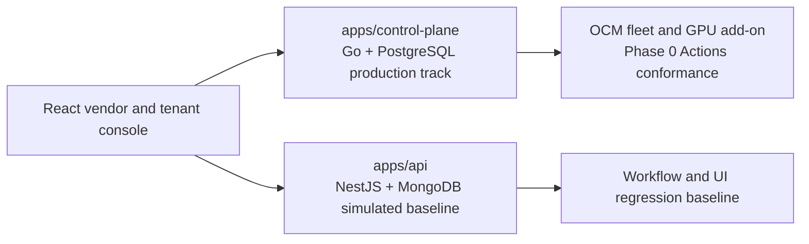
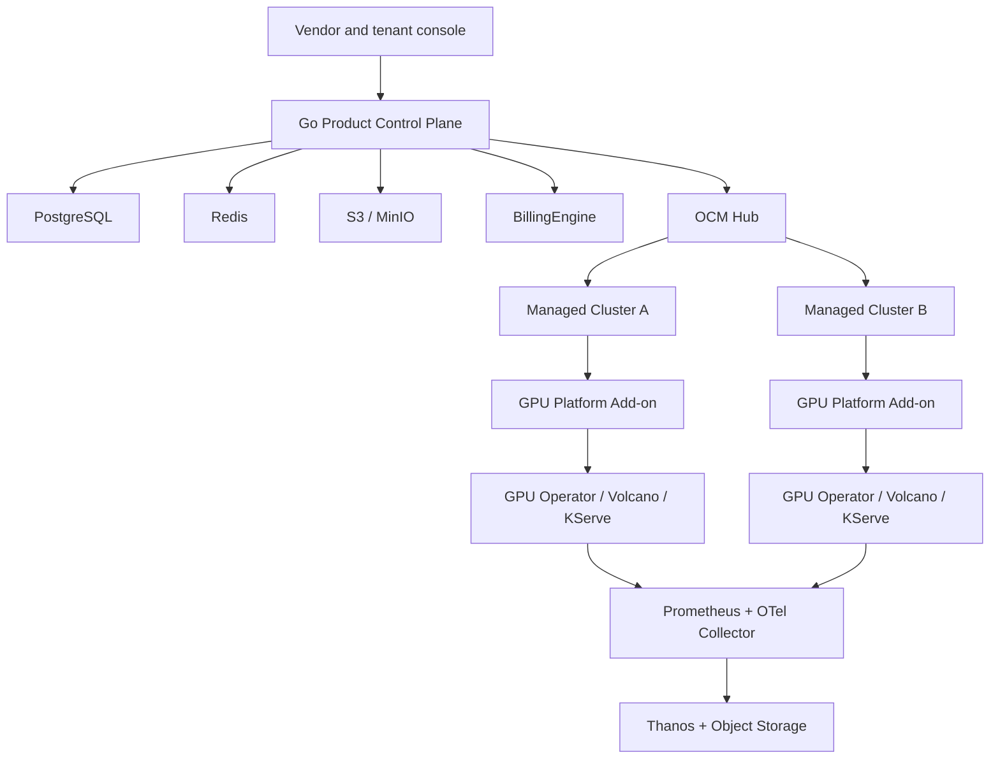
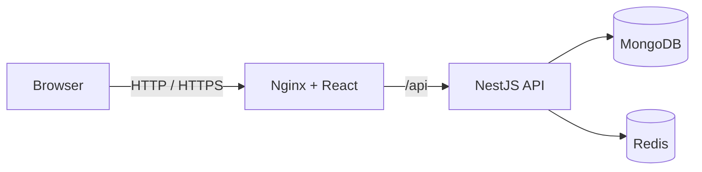

# Architecture

## Overview

The repository advances GPU Container Cloud through two coordinated tracks:



The production track owns the future cloud-vendor control plane. The simulated track remains runnable and supplies product-flow regression coverage while v2 domains are implemented and accepted individually. The complete target, component choices and phase gates are recorded in [control-plane-v2.md](control-plane-v2.md).

## Production v2 target



### Responsibility boundaries

- The Go control plane owns providers, commercial hierarchy, tenants, projects, offerings, operations, quota, allocations, billing facts and audit facts.
- PostgreSQL is the source of truth for transactional v2 business state.
- Redis is reserved for caches, short-lived coordination and reconstructable state.
- OCM owns ManagedCluster registration, CSR and certificate lifecycle, Lease, Placement, ManifestWork and Add-on status.
- The GPU Platform Add-on discovers inventory, executes desired work, reports Allocation and UsageFact records, and provides access tunnels. It has no direct database connection.
- Prometheus and Thanos own operational telemetry. Financial metering derives from allocation intervals and immutable UsageFact records.
- `BillingEngine`, `AuthorizationEngine`, `JobEngine` and `FleetManager` keep product handlers independent from replaceable infrastructure adapters.

## Current implementation boundary

Phase 0 currently establishes the production foundation and first fleet integration:

- a Go 1.25 control plane with validated configuration and process lifecycle;
- PostgreSQL migrations for Operation, idempotency, Outbox and audit foundations;
- transactional Operation and Outbox repositories;
- health, readiness, Prometheus metrics, system information and Operation query endpoints;
- an OpenAPI 3.1 contract under `api/openapi/control-plane-v1.yaml`;
- OCM 1.3.1 Hub/ManagedCluster bootstrap assets with CSR, certificate, Lease and ManifestWork checks;
- an Addon Framework 1.3.0 manager and agent that publish a sanitized Phase 0 capacity fingerprint and OCM health Lease;
- container, Helm, isolated v2 Compose and GitHub Actions validation entry points.

The OCM and Add-on certification result remains pending until the Actions conformance job completes. Hardware GPU inventory, tenant authorization, billing calculation and workload APIs remain subsequent delivery units.

## API and consistency model

Production APIs use `/api/v1`. `X-Request-ID` supplies request correlation. `traceparent` and `tracestate` are currently reserved as the W3C Trace Context header contract for clients and gateways; span creation and export enter with the later OpenTelemetry integration. Future mutation endpoints require `Idempotency-Key`.

Accepted long-running work returns HTTP 202 and a stable Operation reference. Operation status uses `queued`, `running`, `succeeded`, `failed`, `cancelled` and `timed_out`. The record includes target resource, optional parent operation, steps, progress, deadline, retryability, request ID and structured error data.

Business mutations create their durable state, Operation and Outbox event in one PostgreSQL transaction. An executor can claim Outbox work with database locking and deliver it through `JobEngine` or the future OCM adapter. Consumers must remain idempotent because delivery is at least once.

Known-route handler errors and router-generated HTTP 404/405 responses use `application/problem+json`. Resource APIs will maintain `desiredState`, `observedState`, `provisioningState` and Conditions independently.

## Resource and tenancy model

The target resource hierarchy is:

```text
Provider
└── Region
    └── Zone
        └── Cluster
            └── FaultDomain / NodePool
                └── Node
                    └── ResourceProvider
                        └── GPU Device / MIG Partition
```

Placement uses ResourceClass, Trait, Inventory, Reservation, Allocation, AcceleratorProfile and DeviceClaim. Inventory updates use a Generation for optimistic concurrency. Tenant APIs expose stable capability references and keep physical GPU identifiers private.

The commercial hierarchy is `System → Domain / Reseller → Tenant / Account → Project`. Projects select `shared`, `dedicated-node-pool` or `dedicated-cluster` isolation. Namespace isolation is treated as a soft multi-tenant boundary.

## Cluster and failure model

The OCM integration separates `Connected`, `Schedulable`,
`InventoryFresh` and `ExecutionHealthy`. The control-plane domain evaluator
uses a 15-second expected heartbeat interval, a 45-second degraded threshold and
a 90-second offline threshold. Deployments configure the three values through
`AGENT_HEARTBEAT_INTERVAL`, `AGENT_DEGRADED_AFTER` and
`AGENT_OFFLINE_AFTER`; `/api/v1/system/info` publishes the effective policy.

Disconnected clusters keep existing workloads running and stop receiving new
placement. Interactive instances require fencing of the old cluster before
recovery elsewhere. Manual disablement has priority over automatic health
recovery. Management state and health state remain separate for clusters and
nodes. Persisted Cluster Conditions and placement enforcement enter with the
Phase 1 Cluster model.

## Simulated baseline

The existing application remains a modular NestJS API with React, MongoDB and Redis:



It includes authentication, simulated GPU inventory, workload templates, orders, instance lifecycle, wallet records, keys, firewall rules, volumes, snapshots, teams and projects. Redis provides revocable sessions and token-owned reservation locks. MongoDB unique constraints guard duplicate active allocations.

GPU and instance delivery remains simulated. Access addresses use reserved `.invalid` domains, and projected usage does not represent financial metering. This baseline supplies UI behavior and concurrency regression tests without participating in v2 production state.

## Deployment stacks

- **Default Compose:** runs React, NestJS, MongoDB and Redis at `127.0.0.1:8080`.
- **Dedicated v2 Compose stack:** `docker-compose.v2.yml` uses the fixed `gpu-cloud-control-plane-v2` project. PostgreSQL and migrations attach only to the internal backend network; the Go API attaches to backend and edge networks and publishes the edge side at `127.0.0.1:8081`. PostgreSQL uses its own volume.
- **GitHub Pages:** runs the labelled browser-only simulated adapter and contains no backend services.
- **Future vendor deployment:** packages the Go control plane, OCM Hub integration, GPU Add-on, observability stack and supported cluster profiles through Helm and signed OCI artifacts.

Both local stacks are development and validation topologies. Internet-facing deployment still requires managed secrets, TLS, backups, policy enforcement, observability and a completed phase acceptance gate.
