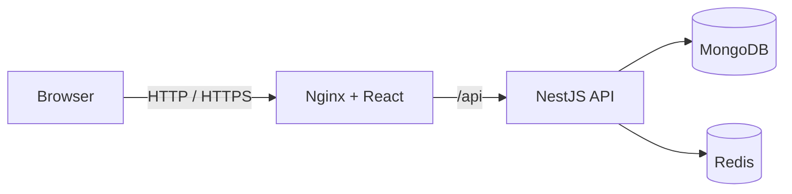

# Architecture

## Overview

The platform is a modular monolith with a React single-page application and a NestJS API. MongoDB stores durable business data, while Redis provides revocable server-side sessions and short-lived resource locks.

The browser has no direct access to MongoDB or Redis. In Docker Compose, Nginx is the only service published to the host, and it is bound to the loopback interface by default.

## Application boundaries

- **Authentication and users** manage credentials, roles and revocable sessions.
- **GPU resources** manage the simulated inventory, searchable specifications and listing state.
- **Orders** own reservation, return, expiry and cancellation transitions.
- **Administration** exposes role-protected inventory, order and overview operations.
- **Health** separates process liveness from dependency readiness.

Shared request, response and enum contracts live in the workspace contracts package. Domain behavior remains in the API rather than in controllers or UI components.

## Reservation consistency

Creating an order uses a resource-scoped Redis lock acquired with `SET NX EX`. Unlocking compares the random owner token before deletion, so an expired request cannot release a successor's lock. A MongoDB unique constraint for active allocations remains the durable final guard against duplicate assignment.

Resource availability is derived from its listing state and active orders. It is not maintained as a second mutable reservation flag on the resource document.

## Session model

Authentication uses an opaque session identifier in an HttpOnly cookie. Redis stores the server-side session with a finite lifetime, which allows logout, logout-all and password changes to revoke access immediately. Public registration cannot choose an administrator role; both API authorization and route guards enforce role boundaries.

## Deployment profiles

- **Docker profile:** the React application calls the real API through Nginx. MongoDB and Redis are private container services.
- **GitHub Pages profile:** the UI uses a clearly labelled browser-only demo adapter. No API, database or infrastructure service is present.

This repository does not provision physical GPUs, virtual machines, containers, payment processing, SSH access or telemetry collection. GPU records represent a simulated marketplace inventory for demonstrating control-plane workflows.
