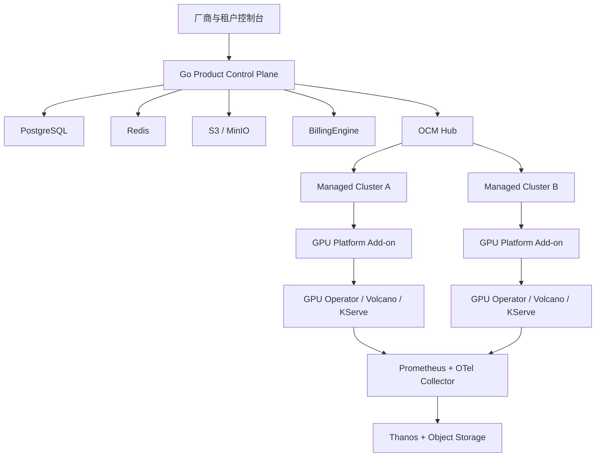

# GPU Cloud Control Plane v2

## 业务定位

GPU Container Cloud 是面向云服务器厂商、渠道商和企业租户的 GPU 容器云控制面。现有 React、NestJS、MongoDB 与 Redis 应用继续承担 UI 和业务流程基准；生产版本按阶段引入 Go、PostgreSQL、Kubernetes 与 Open Cluster Management（OCM）。

仓库当前已有模拟市场、订单、实例、钱包和协作流程。它们不代表真实 GPU 容量、可访问工作负载或生产计费。v2 采用并行替换策略，每项能力通过真实集群验收后再切换生产入口。

## 目标架构



### 职责边界

- Go 控制面保存商业主体、租户、项目、产品规格、订单、Operation、配额、账本和审计事实。
- PostgreSQL 是 v2 业务事实与事务一致性的主存储；Redis 仅承载缓存、短期协调和可重建状态。
- OCM Hub 保存集群注册、CSR、证书、Lease、Placement、ManifestWork 和 Add-on 状态。
- GPU Platform Add-on 发现库存、执行工作、上报 Allocation 与 UsageFact、建立访问隧道；它不直接访问中央数据库。
- Prometheus 与 Thanos 保存运行遥测；商业计量使用 Allocation 区间和不可变 UsageFact。
- `BillingEngine`、`AuthorizationEngine` 和 `JobEngine` 隔离外部计费、授权与调度实现。
- React 控制台逐步改用 OpenAPI 生成客户端，生产 API 固定在 `/api/v1`。

## Phase 0 当前落点

本轮 Phase 0 工作聚焦可独立验证的生产基础。完成状态以 GitHub Actions、认证文档和可追溯运行证据为准。

| 范围       | 当前落点                                                                                         |
| ---------- | ------------------------------------------------------------------------------------------------ |
| 产品契约   | 建立 OpenAPI 3.1 契约，先覆盖健康、指标、系统信息和 Operation 查询                               |
| 控制面     | 建立 Go 模块化单体入口，保持业务边界可测试                                                       |
| 数据一致性 | 建立 PostgreSQL 迁移、Operation、幂等记录、Outbox 和审计基础表                                   |
| 异步执行   | 以数据库事务同时写入业务状态与 Outbox；后续由执行器投递 OCM 工作                                 |
| Fleet      | 固定 OCM 1.3.1、一个 Hub 与两个 ManagedCluster，覆盖 CSR、证书、Lease、ManifestWork 和跨集群授权 |
| Add-on     | 建立 Addon Framework 1.3.0 manager/agent、最小权限、Agent 会话元数据、脱敏容量指纹和 OCM Lease   |
| 可观测性   | 部署 Prometheus、Alertmanager、OTel Collector 与审计归档；控制面应用 Span 后续接入               |
| 部署验证   | 独立 v2 Compose 与 OCM conformance 均由 Actions 执行；硬件 GPU 验证进入自托管门禁                |

ManagedCluster 与 Add-on 的代码和验证入口已经进入仓库。库存快照携带进程级 Agent Epoch、单调上报序列、Fencing Token 与显式 fencing 状态；容量 Generation 继续只表示聚合容量变化。Placement、Reservation 与 Allocation 将使用后续 ResourceProvider generation。真实 GPU 调度、财务计费和生产租户隔离尚未完成。固定版本与证据边界见 [Kubernetes 1.34 首个认证矩阵](certification/kubernetes-1.34-matrix.md)。

v2 交付栈固定使用 `docker-compose.v2.yml`，Compose 项目名为 `gpu-cloud-control-plane-v2`。PostgreSQL 与迁移任务仅连接内部 backend 网络，控制面同时连接 backend 与 edge 网络，并仅通过 edge 将 `127.0.0.1:8081` 发布给宿主机；PostgreSQL 使用独立数据卷，默认模拟栈不会解析 v2 的 PostgreSQL 密码。GitHub Actions 负责 Compose 配置、镜像构建、运行时健康端点和清理验证。 数据库迁移设置五分钟总超时、三十秒锁等待和两分钟语句超时，并允许厂商部署覆盖。 初始迁移只创建当前月和下月的审计分区；后续 Phase 0 运维任务必须在月界前创建未来分区并监控 default 分区，自动分区维护尚未完成。

## 核心领域模型

资源层级固定为：

```text
Provider
└── Region
    └── Zone
        └── Cluster
            └── FaultDomain / NodePool
                └── Node
                    └── ResourceProvider
                        └── GPU Device / MIG Partition
```

资源模型使用 `ResourceClass`、`Trait`、`Inventory`、`Reservation`、`Allocation`、`AcceleratorProfile` 和 `DeviceClaim`。库存以 `Generation` 乐观并发控制；租户只看到产品能力和稳定资源引用，不接收物理 GPU 标识。

商业主体层级为 `System → Domain / Reseller → Tenant / Account → Project`。角色可作用于 System、Domain、Tenant、Project 或 Cluster。

每个 Project 选择一种隔离等级：

- `shared`：Namespace、RBAC、ResourceQuota、NetworkPolicy 和 Restricted Pod Security。
- `dedicated-node-pool`：独占 NodePool、Taint/Toleration 和 CapacityPool。
- `dedicated-cluster`：租户独占 ManagedCluster。

Namespace 属于软多租户边界。公网客户、敏感数据和强 SLA 进入独占节点池或独占集群。

## API 与异步 Operation

公开资源按领域逐步落到 `/api/v1`：domains、tenants、projects、regions、zones、clusters、node-pools、resource-classes、accelerator-profiles、capacity-pools、offerings、price-books、instances、jobs、inference-endpoints、volumes、snapshots、security-groups、operations、usage-facts、invoices 与 audit-events。

当前 `/api/v1/instances` 首个生产切片提供 GPU Workspace 的异步创建、读取、`desiredState` 更新和 VolumeSnapshot 创建/读取。创建请求从 AcceleratorProfile 读取整卡 GPU 数量，并支持 `storageGiB` 持久化容量。Workspace 运行态变更会在同一事务中原子调整项目 `gpu.nvidia.full` allocated 配额；超过 hard limit 的请求会被拒绝。OCM ManifestWork 生成带 `nvidia.com/gpu` 请求的 StatefulSet、headless Service、PVC 和 Workspace 级 NetworkPolicy；策略默认拒绝流量，仅允许同 Workspace 通信与集群 DNS。停止状态保留 PVC、隔离策略和快照对象，终止状态清理计算、卷和策略资源。Service 暴露 SSH、Web Terminal、Jupyter 端口，并生成 Gateway API HTTPRoute 与跨命名空间 ReferenceGrant，统一绑定厂商的 `gateway-system/gpu-platform-gateway`。`/api/v1/instances/{instanceId}/access-tokens` 为三类访问发行默认十分钟短期令牌，数据库保存令牌哈希，发行事件进入审计和幂等记录；对应 DELETE 接口可撤销令牌并生成异步 Operation。受认证保护的 `/api/v1/access-tokens/introspect` 向网关返回活动令牌的 Workspace、类型和到期时间。Workspace outbox 事件由独立 Runner 投递到 OCM，并按 generation 回写 `observedState` 与 `provisioningState`；快照事件完成后记录 `succeeded` 状态。

协议约束：

- 所有变更请求要求 `Idempotency-Key`。
- 异步请求返回 HTTP 202、目标资源 ID 和 Operation ID。
- Operation 状态为 `queued`、`running`、`succeeded`、`failed`、`cancelled` 或 `timed_out`。
- 资源分别保存 `desiredState`、`observedState`、`provisioningState` 和 Conditions。
- 已实现的处理器错误及路由层 404/405 使用 `application/problem+json`，列表使用游标分页。
- Webhook 使用 HMAC、指数退避、死信与人工重放。

配额和容量提交遵循单一事务流程：验证权限与规格，创建 Quota Reservation，执行 Placement，创建 Allocation，通过 ManifestWork 分发，收到 Add-on 确认后提交 Reservation。失败和超时释放占用，提交后再次检查并发配额越界。

## 集群与故障语义

OCM 负责 ManagedCluster 双向确认、证书轮换、Cluster UID、Lease、ManifestWork、Placement 和 Add-on 生命周期。GPU Platform Add-on 的库存报告维护进程级 Agent Epoch、单调上报序列和 Fencing Token，并支持控制面 N/N-1 兼容。首个工作负载命令通道落地时增加命令接收序列和拒绝陈旧命令的执行门禁；Allocation、UsageFact 与访问隧道随对应业务阶段接入。

集群状态分别记录 `Connected`、`Schedulable`、`InventoryFresh` 和 `ExecutionHealthy`。Phase 0 控制面已实现独立状态求值器：默认心跳周期 15 秒，超过 45 秒进入 degraded，超过 90 秒进入 offline；库存超过 45 秒视为不新鲜。手工禁用、执行不健康或处于 Fenced 状态时，`Schedulable` 固定为 false。三个阈值通过部署变量配置，并由 `/api/v1/system/info` 发布生效值。Cluster Conditions 的持久化和 Placement 强制执行随 Phase 1 Cluster 模型接入。

Agent 断线后保留现有工作负载，离线集群停止新调度。交互实例只有在旧集群完成 Fencing 后才能恢复到其他集群。手工禁用优先于自动健康恢复。节点管理状态和健康状态使用独立字段。

## GPU 与工作负载发布顺序

GPU 能力按以下顺序验收：

1. Real Alpha：NVIDIA Device Plugin 整卡。
2. Private Beta：MIG 固定规格。
3. Partner Beta：HAMi 显存与算力切分。
4. Best-effort：NVIDIA Time-Slicing 研发 SKU。
5. Experimental：NVIDIA DRA。

DRA 进入正式 Profile 需要 NVIDIA 生产支持声明、GPU Operator 正式托管驱动，并通过两个认证 Kubernetes 版本的安装、升级、回滚与故障验证。

交互产品使用 GPU Workspace 或 GPU Container Instance，底层由 StatefulSet/Pod、PVC、Service、Gateway Route 与 NetworkPolicy 组成。停止释放计算并保留持久卷；SSH、Web Terminal 和 Jupyter 经过统一访问网关与十分钟短期令牌。

批训练提供互斥 Profile：`hpc-volcano` 是生产默认，`standard-kueue` 用于标准 Kubernetes 兼容。同一 CapacityPool 只能绑定其中一个 Profile。推理首个生产路径采用 KServe Standard InferenceService、Gateway API 与 HPA/KEDA；高级 LLMInferenceService 和 Prefill/Decode 分离留在 Beta。

## 计费、身份与可观测性

计费事实分成四层：不可变 `UsageFact`、带价格版本的 `RatedUsage`、不可变 `LedgerEntry` 和账期 `Invoice`。迟到或乱序事实可重放，价格调整不改写历史，账本调整使用冲正。控制面已提供按资源单位秒计价、版本化价格簿、货币和向上取整规则的内置 BillingEngine；UsageFact 持久化与账本流水随后接入同一接口。OpenMeter 在 Phase 2 进行两个完整账期的影子双算。

控制面只依赖标准 OIDC。Keycloak 提供验证过的可选部署 Profile，系统保留一个 Break-glass 本地管理员。首版授权由 PostgreSQL RoleBinding 承担；出现自定义角色、跨项目分享和层级继承后再评估 OpenFGA。

每个集群部署 Prometheus 和 OTel Collector，中央使用 Thanos Query、对象存储、Grafana 与 Alertmanager。审计事件追加写入 PostgreSQL 月度分区，并归档到启用 Object Lock 的 S3/MinIO。OTel 保存可搜索副本，财务计量不依赖 Prometheus 指标。

## 迁移与切换策略

当前没有生产用户数据，v2 使用并行替换：

1. 保持现有 UI 与模拟控制面可运行，用作流程和视觉回归基准。
2. 在独立 Go 服务中建立 `/api/v1`、PostgreSQL schema、Operation 与 Outbox。
3. 逐个领域接入真实 OCM/GPU 执行路径，并用 OpenAPI 客户端替换对应 UI adapter。
4. 每项能力通过真实集群、故障和幂等验收后切换入口。
5. 完成业务等价性和数据保留检查后再移除旧模拟路径。

此策略不执行 MongoDB 生产数据迁移。若后续出现试点数据，必须另行设计可回放迁移、校验和回滚方案。

## 交付阶段

- **Phase 0 — 组件验证与生产基础：** Go、PostgreSQL、OpenAPI、Outbox、Operation、Helm、OCM Hub、最小 Add-on、固定兼容矩阵、GPUStack 对照、可观测性基础。
- **Phase 1 — Real Alpha：** 真实整卡实例、共享租户隔离、配额、PVC、快照、安全组、访问网关和 DCGM。
- **Phase 2 — Private Beta：** 多集群 Placement、Domain/Reseller、三档隔离、MIG、完整计费、OpenMeter 影子双算、Keycloak Profile、Thanos 和白标控制台。
- **Phase 3 — Partner Beta：** Volcano、训练工作负载、队列与抢占、HAMi 和 Kueue 兼容 Profile。
- **Phase 4 — Release Candidate：** KServe、灰度与回滚、安全供应链、备份恢复、离线安装、升级回滚和运维文档。
- **Phase 5 — GPU Container Cloud GA：** 10 集群、1000 GPU、1 万租户、10 万资源对象与每日 100 万 UsageFact 的容量验证和厂商试点验收。
- **Phase 6 — GPU VM：** Container GA 后复用商业控制面，增加 KubeVirt/Harvester 的整卡直通、vGPU 和完整 VM 生命周期。

Karmada、Cluster API、SkyPilot、OpenFGA 和 Temporal 由真实复杂度触发。首版认证范围为 Linux、containerd、NVIDIA GPU 和 Kubernetes 1.34.x；新增 Kubernetes 版本需要独立完成兼容验证。

## Phase 1 租户控制面当前落点

当前交付单元建立 Tenant、Project、RoleBinding、ProjectQuota 与 QuotaReservation 的 PostgreSQL 事实模型。租户、项目、角色绑定和配额变更统一要求 `Idempotency-Key`，并在一个事务内写入领域事实、Operation、Outbox、审计事件和幂等记录。重复请求返回原资源 ID 与 Operation ID；同一个幂等键携带不同请求内容时返回冲突。

控制面提供一个可选的本地 Break-glass Bearer 身份用于厂商初始化和紧急恢复。令牌只从环境变量或 Helm 引用的外部 Secret 读取，审计主体由 `BREAK_GLASS_ADMIN_SUBJECT` 固定标识。PostgreSQL RoleBinding 已实现 Tenant 与 Project scope 的授权判定，为后续 OIDC 主体接入保留同一 `AuthorizationEngine` 边界。

Project 当前只接受 `shared` 隔离等级，创建后保存稳定 Namespace 名称以及独立的 desired、observed 和 provisioning 状态。启用 OCM 后，GPU 配额更新使用专用 `project.gpu-quota.updated` 事件；Outbox 执行器通过服务端 apply 投递确定性的 ManifestWork，创建 Namespace、只读 Add-on RBAC、GPU ResourceQuota、默认拒绝与必要放行 NetworkPolicy、Restricted Pod Security 标签；ManifestWork 同时达到 `Applied` 和 `Available` 后回写目标集群、ObservedGeneration、已应用 GPU 配额、`SharedIsolationReady` Condition，并完成对应 Operation。

ProjectQuota 分别保存硬限制、预留量和已分配量。QuotaReservation 使用数据库行锁检查可用量，支持 pending、committed、released 与 expired 状态；提交将预留量转为已分配量，释放和过期会归还对应额度。财务计量仍以后续 Allocation 与 UsageFact 为准。
